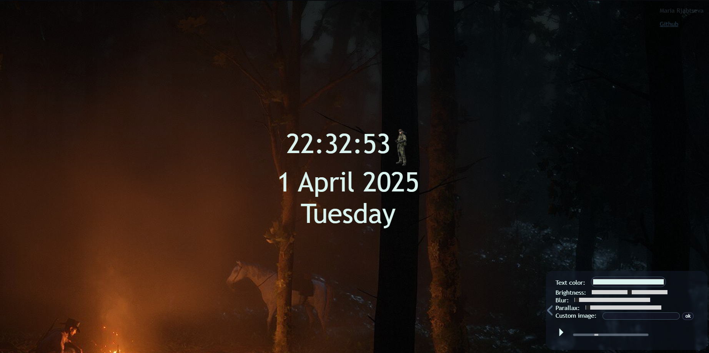

### **README.md – Funktsionaalsuse kirjeldus **  

# ** 1. Kodutöö – Elektrooniline kell**  
**Autor:** Maria Rjabtseva 
**Repo link:** https://github.com/nkdsnaketlu/1kodutoo

---

## ** Funktsionaalsus**  
See veebirakendus näitab **elektroonilist kella**, mis on kohandatav ja sobib kasutamiseks **lauakella või ekraanisäästjana**

### ** Kasutaja saab muuta järgmist:**  
**Kella värvi** – Muuda kella ja teksti värvi värvivalija abil
**Taustapilti** – Kasutaja saab lisada oma taustapildi
**Taustavälimus** - Kasutaja saab muuta tausta *heledust ja hägusust(blur)*
**Parallax** - Veebilehel on parallaksi efekt, kasutaja saab efekti tugevust muuta
**Muusikat** – Veebilehel on oma muusikafail, heli saab reguleerida

---
